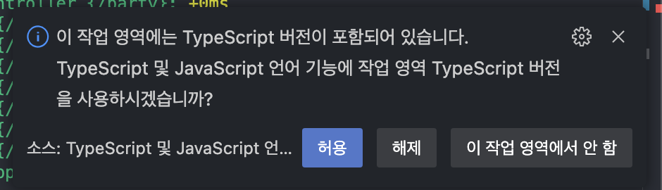

# SDC-STOCK

## 소개
SDC-STOCK은 실시간 주식 거래 게임 플랫폼입니다. React와 NestJS를 기반으로 제작된 모노레포 프로젝트입니다.

## 프로젝트 구조

### 앱
- `app/koi-client`: 프론트엔드 애플리케이션
- `app/koi-server`: 백엔드 애플리케이션

### 패키지
- `package/shared/type-stock`: 주식 게임 관련 타입 정의
- `package/shared/config`: 공통 설정
- `package/feature/feature-nest-stock`: 주식 게임 NestJS 기능 모듈
- `package/library/lib-dayjs`: dayjs 유틸리티 라이브러리

## 주요 기능

### 1. 주식 게임 시스템
- 실시간 주가 변동
- 주식 매수/매도 기능
- 실시간 순위 시스템
- 라운드 시스템
- 거래 제한 시스템

### 2. 백오피스 기능
- 게임 상태 관리
- 주식 시세 조정
- 플레이어 관리
- 실시간 모니터링

## 기술 스택
- 프론트엔드
  - React 18
  - TypeScript
  - Emotion
  - Tanstack Query
  - Vite

- 백엔드
  - NestJS
  - MongoDB (Mongoose)
  - AWS Lambda
  - Serverless Framework

## 설치 및 실행

### 사전 요구사항

1. NVM(Node Version Manager) 설치

- Windows:
  
  https://github.com/coreybutler/nvm-windows/releases 에서 nvm-setup.exe 다운로드 및 실행

- Mac/Linux:
    ```bash
    # nvm 설치 스크립트 실행
    curl -o- https://raw.githubusercontent.com/nvm-sh/nvm/v0.39.0/install.sh | bash

    # 터미널 재시작 후 설치 확인
    nvm --version
    ```
2. Node.js 설치
    ```bash
    # 프로젝트에서 요구하는 Node.js 22.17.0 설치
    nvm install 22.17.0

    # 설치된 버전으로 전환
    nvm use 22.17.0

    # 기본 버전으로 설정
    nvm alias default 22.17.0
    ```

3. Yarn 설치
    ```bash
    npm install -g yarn@berry
    ```

### 프로젝트 설정

1. 의존성 설치
    ```bash
    yarn install
    ```

2. 개발 서버 실행

- 서버: [./app/koi-server README.md](https://github.com/omizha/sdc-stock/blob/main/app/koi-server/README.md) 참고
- 클라이언트: [./app/koi-client README.md](https://github.com/omizha/sdc-stock/blob/main/app/koi-client/README.md) 참고

3. VSCode에서 아래 메시지가 뜨는 경우, `허용`으로 설정
    

## 라이선스
AGPL-3.0


